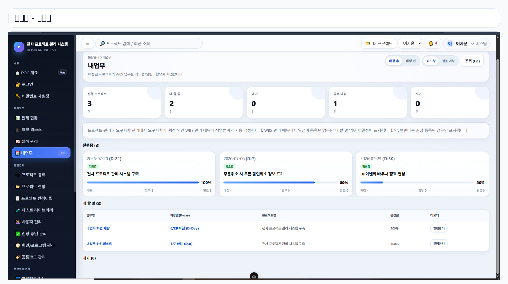
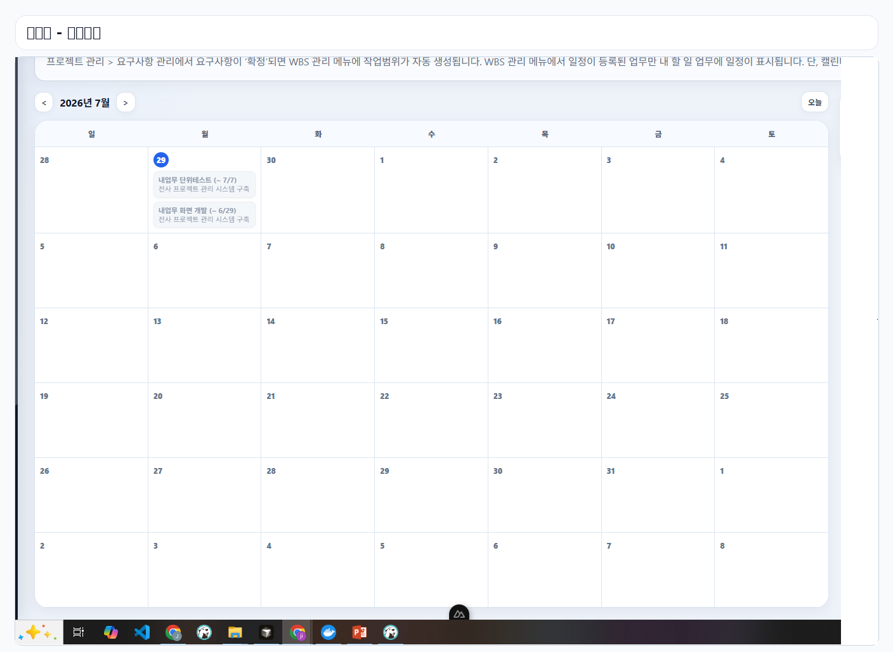
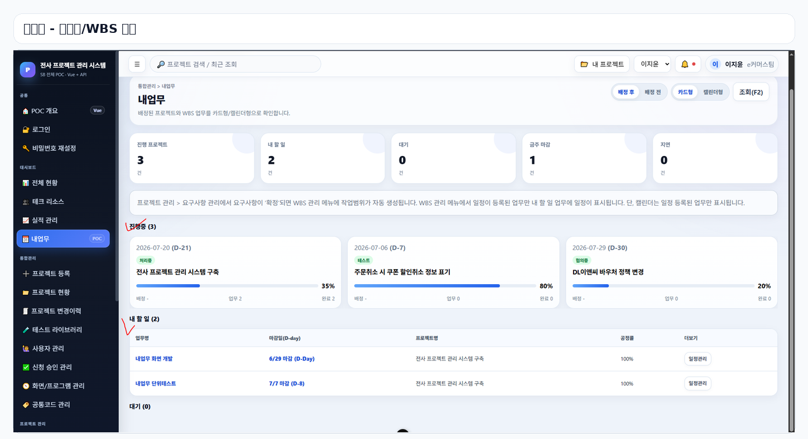

# README 화면 이미지 적용 방법

이 압축 파일의 `docs/images` 폴더를 프로젝트 루트에 복사하세요.

복사 위치:

```text
D:\pms_fullstack_clean_sb\docs\images
```

그 다음 README.md 원하는 위치에 아래 내용을 붙여넣으세요.

```md
## 주요 화면

### 내업무 - 카드형



### 내업무 - 캘린더형



### 내업무 - 공정률/WBS 연동


```

Git 반영:

```powershell
cd D:\pms_fullstack_clean_sb
git add README.md docs/images
git commit -m "docs: add PMS screen captures"
git push
```
